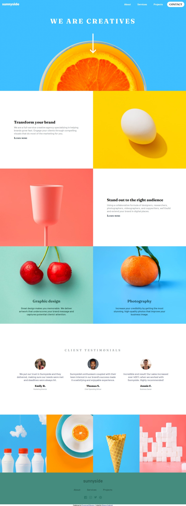

# Frontend Mentor - Sunnyside agency landing page solution

This is a solution to the [Sunnyside agency landing page challenge on Frontend Mentor](https://www.frontendmentor.io/challenges/sunnyside-agency-landing-page-7yVs3B6ef). Frontend Mentor challenges help you improve your coding skills by building realistic projects.

## Table of contents

- [Overview](#overview)
  - [The challenge](#the-challenge)
  - [Screenshot](#screenshot)
  - [Links](#links)
- [My process](#my-process)
  - [Built with](#built-with)
  - [What I learned](#what-i-learned)
  - [Continued development](#continued-development)
- [Author](#author)
- [Acknowledgments](#acknowledgments)

## Overview

### The challenge

Users should be able to:

- View the optimal layout for the site depending on their device's screen size
- See hover states for all interactive elements on the page

### Screenshot

### Links

- Solution URL: [Solution URL here](https://www.frontendmentor.io/solutions/responsive-landing-page-using-css-flexbox-js-4Sc1hjtKe4)
- Live Site URL: [Live site URL here](https://i-strider243.github.io/sunnyside-agency-landing-page-main/)

## My process

### Built with

- Semantic HTML5 markup
- CSS custom properties
- Flexbox
- JS
- Mobile-first workflow
- [Icons](https://fontawesome.com/) - For Icons

### What I learned
I learn't about more CSS selectors and JS Dom Manipulation

### Continued development

I want to continue focusing on strengthening my knowledge of Javascript. I would also like to focus on learning CSS Grid. I will continue to learn about Responsiveness and Accessibility.

## Author

- Website - [Add your name here](https://www.your-site.com)
- Frontend Mentor - [@i-Strider243](https://www.frontendmentor.io/profile/i-Strider243)
- Twitter - [@Strider18](https://twitter.com/Strider18)

## Acknowledgments

I was able to complete this project, thanks to Wes Bos and Kevin Powell's good Youtube Contents.
